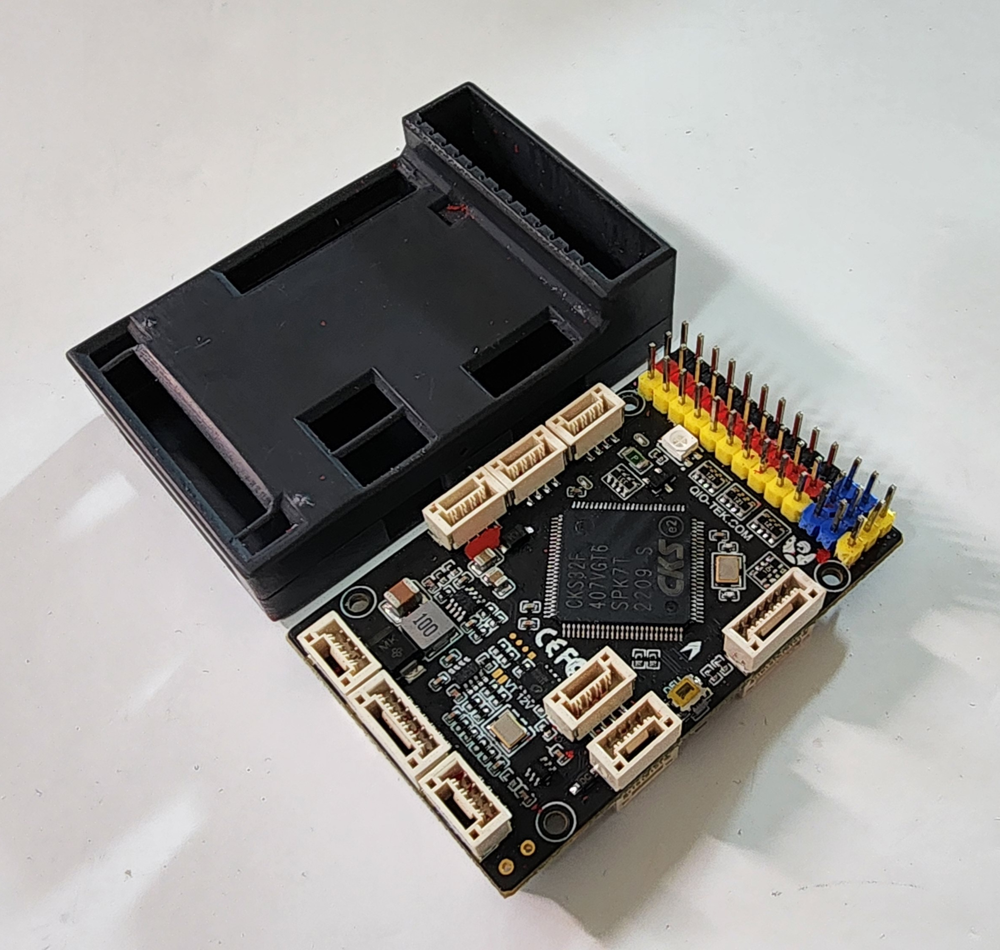

.. _common-qiotekadeptf407:

==================
Qio-Tek Adept F407
==================

The Qio-Tek Adept F407 has a number of features useful for planes and quadplanes. It could also be used for
Rover, Sub and Blimp. 

- More memory than the STM32F405 due to additional RAM (324K total) included in the CKS32F407 processor
- Sufficient outputs for QuadPlane applications, as well as normal complex Fixed Wing applications
- Full peripheral capabiliy: GPS/Compass/Analog or Digital Airspeed/SBUS,PPM or Serial RC/HD Video/Rangefinders,etc.
- JST-GH connectors for most peripherals, Dupont connectors for motor/servo, serial RC/SBus and External USB
- Integrated current and voltage monitors and power management with a build in BEC with up to 8S battery input
- Two PixHawk standard power inputs for external power monitoring with a PDB
- Integrated analog OSD with Video out to VTX
- VTX control via IRX TRAMP or SmartAudio
- Power output for the VTX 12 V or 9 V (selected by solder pad)
- Four relay outputs
- No soldering required!

Plus several unique features:

- Dual camera inputs with a built in relay (relay 5) to select the camera feed to the OSD
- SBus in with inverter and SBus out with inverter (solder pad to enable the inverter) 

the above image and some content courtesy of `Qio-Tek <http://qio-tek.com/>`__

.. note::

	Due to flash memory limitations, this board does not include all ArduPilot features.
        See :ref:`Firmware Limitations <common-limited_firmware>` for details.

Specifications
==============

-  **Processor**

   -  CKS32F407VGT6 - 32 Bit Arm® Cortex®-M3, 168MHz, 1MB memory, 324KB RAM
   -  AT7456E OSD with 2 camera inputs and built in camera selector

-  **Sensors**

   -  ICM-20608 IMU (accel, gyro)
   -  ICM-40605 IMU (accel, gyro)
   -  DPS310 barometer
   -  QMC5883 Compass/Magnetometer

-  **Power**

   -  2S - 8S Lipo input voltage, 5A max current, with voltage monitoring
   -  3A BEC for servos
   -  Servo Rail power input 0 - 36V

-  **Interfaces**

   -  12x PWM outputs 
   -  2x  PWM outputs on GH connectors
   -  1x  Status LED
   -  1x  Armed LED
   -  1x  RC input for Spectrum/DSM and SBus (with pad selectable inverter)
   -  1x  PixHawk standard GPS connector which can also be used as a UART
   -  5x  UARTs/serial ports (including the GPS port)
   -  1x  CAN port 
   -  1x  I2C port for external compass, airspeed, etc.
   -  1x  VTX connector with power (9v or 12v), Video out and SmartAudio
   -  2x  PixHawk standard PDB connectors for power monitoring and to power the AP
   -  microSDCard for logging, etc.
   -  USB-C port

-  **Size and Dimensions**

   - 59mm x 38mm x 17mm
   - 26g
   - Operating temperature -20C to +85C

Where to Buy
============

`SmartFleet Systems <https://smartfleet.systems/product/qiotek-adept-f407/>`__

User Manual
===========

`Qio-Tek Adept F407 User Manual <../../../images/qiotek-adeptF407-manual.jpg>`__

Default UART order
==================

The UARTs are marked Rn and Tn in the above pinouts. The Rn pin is the
receive pin for UARTn. The Tn pin is the transmit pin for UARTn.

 - SERIAL0 -> USB
 - SERIAL1 -> UART1 (DMA capable)
 - SERIAL2 -> UART2 
 - SERIAL3 -> UART3 (GPS) (TX DMA capable)
 - SERIAL4 -> UART4 (User) (TX DMA capable)
 - SERIAL5 -> UART5 (RX tied to inverted SBUS RC input, but can be used as normal UART)

Serial protocols shown are defaults, but can be adjusted to personal preferences.

RC Input
========

The SBUS pin, is passed by an inverter to RX2 (UART2 RX), which by default is mapped to a timer input instead of the UART, and can be used for all ArduPilot supported receiver protocols, except CRSF/ELRS and SRXL2 which require a true UART connection. However, FPort, when connected in this manner, can provide RC without telemetry. 

With this option, :ref:`SERIAL2_PROTOCOL<SERIAL2_PROTOCOL>` must be set to "23", and:

- PPM is not supported.

- DSM/SRXL connects to the RX2  pin, but SBUS would still be connected to SBUS.

- FPort requires connection to TX2 and RX2 via a bi-directional inverter. See :ref:`common-FPort-receivers`.

- CRSF also requires a TX2 connection, in addition to RX2, and automatically provides telemetry.

- SRXL2 requires a connection to TX2 and automatically provides telemetry.  Set :ref:`SERIAL2_OPTIONS<SERIAL2_OPTIONS>` to "4".

.. note:: UART1 is configured by default for serial receivers. You can also have more than one receiver in the system at a time (usually used for long range hand-offs to a remote TX). See :ref:`common-multiple-rx` for details.

Any UART can be used for RC system connections in ArduPilot also, and is compatible with all protocols except PPM (SBUS requires external inversion on other UARTs). See :ref:`common-rc-systems` for details.

.. note:: the "4V5" pin above the SBUS pin and the 4V5 pins in the GPS, Airspeed, and Telem connectors are powered when USB is connected. Be careful not to present too much load to the USB source or voltage droop may occur. All other 5V pins are only powered when battery is present.

OSD Support
===========

The Qio-Tek Adept F407 supports using its internal OSD using OSD_TYPE 1 (MAX7456 driver). External OSD support such as DJI or DisplayPort is supported using any free UART. The VT port provides Video out and 9V or 12V power for a VTX. and IRC Tramp or Smart Audio control via a dedicated pin on this connector.

Battery Monitor Configuration
=============================
These settings are set as defaults when the firmware is loaded (except :ref:`BATT_AMP_PERVLT<BATT_AMP_PERVLT>` which needs to be changed from the default value). However, if they are ever lost, you can manually set the parameters:

Enable Battery monitor.

:ref:`BATT_MONITOR<BATT_MONITOR>` =4

Then reboot.

:ref:`BATT_VOLT_PIN<BATT_VOLT_PIN>` 10

:ref:`BATT_CURR_PIN<BATT_CURR_PIN>` 11

:ref:`BATT_VOLT_MULT<BATT_VOLT_MULT>` 11.05

:ref:`BATT_AMP_PERVLT<BATT_AMP_PERVLT>` 50

Connecting a GPS/Compass module
===============================

This board does not include a GPS so an :ref:`external GPS/compass <common-positioning-landing-page>` should be connected as shown below in order for autonomous modes to function.

Firmware for this board can be found `here <https://firmware.ardupilot.org>`_ in  sub-folders labeled
"QioTekAdeptF407".

[copywiki destination="plane,copter,rover,blimp"]

